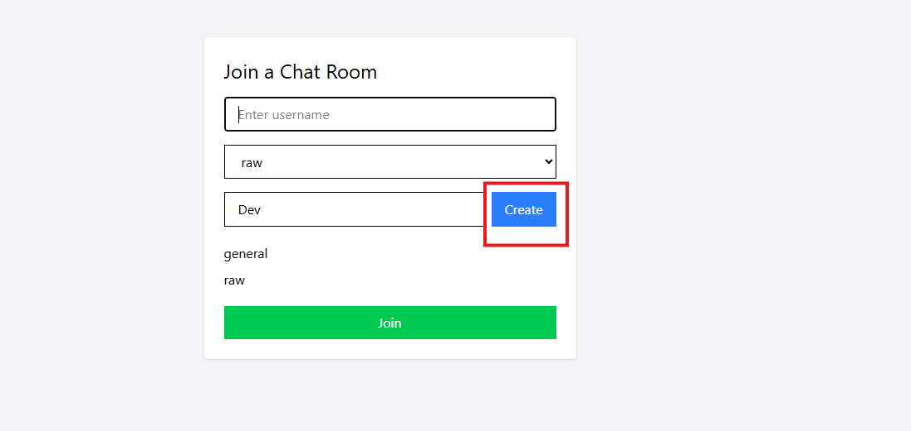
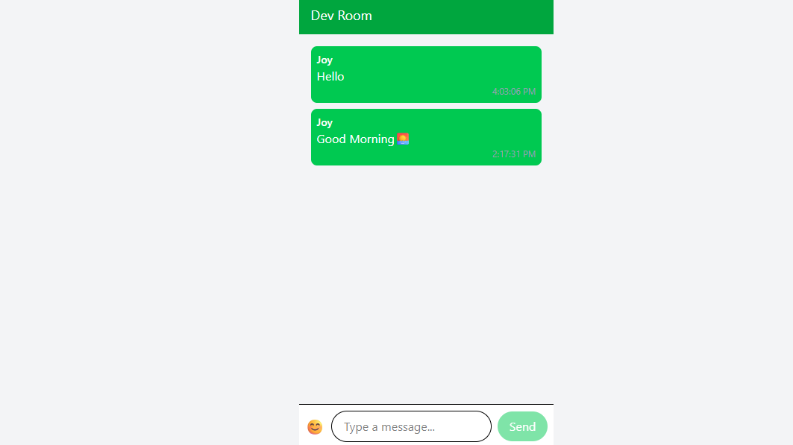
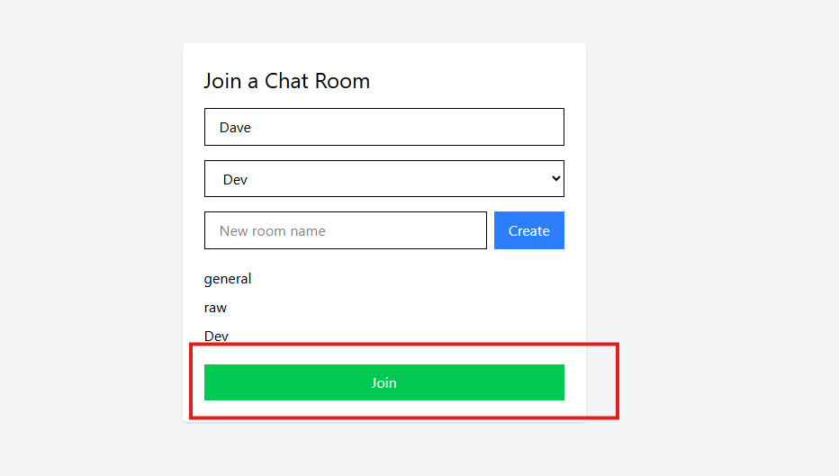
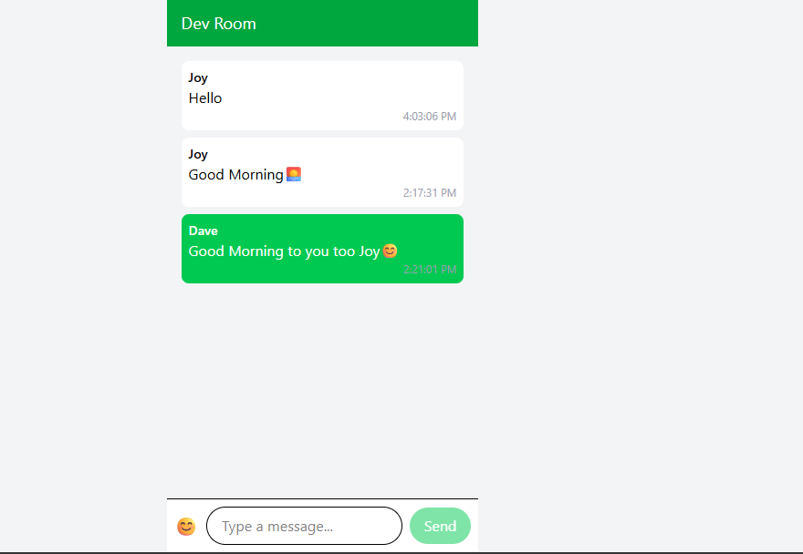

# 🗨️ MERN Chat App – Real-Time Messaging with DevOps 🚀

This is a real-time chat application built with the **MERN stack** (MongoDB, Express, React, Node.js), using **Socket.io** for live communication, deployed via **Vercel** (frontend) and **Render** (backend), and integrated with **GitHub Actions** for continuous deployment.

Live Demo:

* 🖥️ Frontend: [https://chatapp-uuci.vercel.app/](https://chatapp-uuci.vercel.app/)
* 🌐 Backend: [https://week-7-devops-deployment-assignment-9ycj.onrender.com/rooms](https://week-7-devops-deployment-assignment-9ycj.onrender.com/rooms)

---

## 📦 Tech Stack

* **Frontend:** React + Tailwind CSS + Vite
* **Backend:** Express.js + Node.js + MongoDB
* **Realtime:** Socket.io
* **Database:** MongoDB Atlas
* **CI/CD:** GitHub Actions + Vercel + Render

---

## ✨ Features

* 🔒 Room creation & deletion (admin-only)
* ⚡ Real-time chat with Socket.io
* 💬 Message persistence in MongoDB
* 📁 Room selection and joining
* 📝 Typing indicators
* 🧑 Online users list
* 🎨 Responsive modern UI with Tailwind CSS
* 🚀 CI/CD with automated deployments

---

## 🛠 Project Structure

```
├── client/              # Frontend React app (Vercel)
│   └── src/
│       └── components/
│       └── App.jsx
│       └── main.jsx
├── server/              # Backend Node + Express app (Render)
│   └── controllers/
│   └── models/
│   └── routes/
│   └── socket/
│   └── server.js
├── .github/workflows/   # GitHub Actions for CI/CD
│   └── mern-ci-cd.yml
```

---

## 🚀 Local Development

### 1. Clone Repo

```bash
git clone https://github.com/PLP-MERN-Stack-Development/week-7-devops-deployment-assignment-Jepkosgei3.git
cd week-7-devops-deployment-assignment-Jepkosgei3
```

### 2. Set Up Environment Variables

#### In `client/.env`:

```env
VITE_API_BASE_URL=https://your-backend-url.onrender.com
```

#### In `server/.env`:

```env
PORT=4000
MONGO_URI=mongodb+srv://<your_mongo_uri>
CORS_ORIGIN=https://your-frontend-url.vercel.app
```

### 3. Run Locally

#### Backend:

```bash
cd server
npm install
npm run dev
```

#### Frontend:

```bash
cd client
npm install
npm run dev
```

---

## 🔄 Deployment

### Frontend – Vercel

* Auto-deploys on `main` branch push
* Uses `vercel.json` to define build settings

### Backend – Render

* Create Web Service from `server/`
* Add `web: node server.js` as start command
* Set environment variables in Render dashboard

### CI/CD – GitHub Actions

Workflow file: `.github/workflows/mern-ci-cd.yml`

```yaml
name: CI/CD Pipeline

on:
  push:
    branches: [main]
  pull_request:

env:
  NODE_ENV: production

jobs:
  test-backend:
    name: 🧪 Test Backend
    runs-on: ubuntu-latest
    defaults:
      run:
        working-directory: ./server
    steps:
      - uses: actions/checkout@v3

      - name: Set up Node.js
        uses: actions/setup-node@v3
        with:
          node-version: 18

      - name: Install pnpm
        run: npm install -g pnpm

      - name: Install backend dependencies
        run: pnpm install

      - name: Run backend tests
        run: pnpm test || echo "No tests found"

  test-frontend:
    name: 🧪 Test Frontend
    runs-on: ubuntu-latest
    defaults:
      run:
        working-directory: ./client
    steps:
      - uses: actions/checkout@v3

      - name: Set up Node.js
        uses: actions/setup-node@v3
        with:
          node-version: 18

      - name: Install pnpm
        run: npm install -g pnpm

      - name: Install frontend dependencies
        run: pnpm install

      - name: Build frontend
        run: pnpm run build

  deploy-frontend:
    name: 🚀 Deploy Frontend to Vercel
    environment: ChatApp
    needs: [test-frontend]
    if: github.ref == 'refs/heads/main'
    runs-on: ubuntu-latest
    steps:
      - uses: actions/checkout@v3

      - name: Deploy to Vercel
        uses: amondnet/vercel-action@v20
        with:
          vercel-token: ${{ secrets.VERCEL_TOKEN }}
          vercel-org-id: ${{ secrets.VERCEL_ORG_ID }}
          vercel-project-id: ${{ secrets.VERCEL_PROJECT_ID }}
          vercel-args: '--prod'
          
        env:
          VERCEL_TOKEN: ${{ secrets.VERCEL_TOKEN }}

      - name: ✅ Check Frontend Health
        run: |
          echo "Checking frontend at ${{ secrets.FRONTEND_URL }}"
          curl -sSf ${{ secrets.FRONTEND_URL }}

  deploy-backend:
    name: 🚀 Deploy Backend to Render
    environment: ChatApp
    needs: [test-backend]
    if: github.ref == 'refs/heads/main'
    runs-on: ubuntu-latest
    steps:
      - name: Trigger Render Deploy Hook
        run: curl -X POST ${{ secrets.RENDER_DEPLOY_HOOK }}

      - name: 🩺 Check Backend Health
        run: |
          echo "Waiting 30s for backend to restart..."
          sleep 30
          echo "Checking backend at ${{ secrets.BACKEND_URL }}/health"
          curl -sSf ${{ secrets.BACKEND_URL }}/health
```

---

## 📷 Screenshots






---


## 👩🏽‍💻 Author

**Mercy Jepkosgei**
[GitHub](https://github.com/Jepkosgei3)


